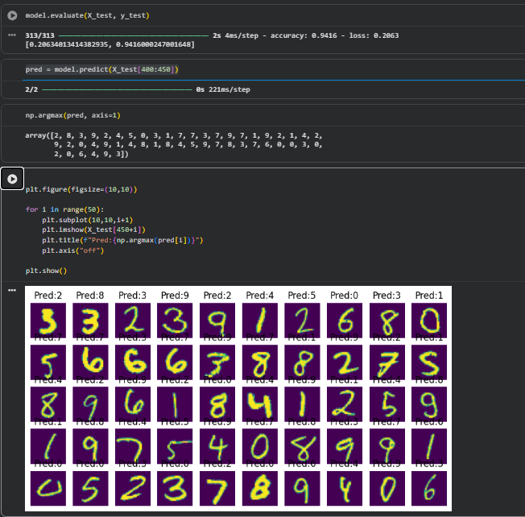

# طبقه‌بندی اعداد دست‌نویس MNIST با Keras

یک پروژه یادگیری عمیق با استفاده از TensorFlow و Keras برای طبقه‌بندی اعداد دست‌نویس موجود در دیتاست MNIST.

## معرفی پروژه

در این پروژه یک مدل شبکه عصبی ساخته شده است که قادر است اعداد دست‌نویس از ۰ تا ۹ را تشخیص داده و طبقه‌بندی کند.

## تکنولوژی‌های استفاده شده

* Python
* TensorFlow
* Keras
* NumPy
* Matplotlib

## معماری مدل

مدل ساخته شده شامل لایه‌های زیر است:

* لایه Flatten برای تبدیل تصاویر ۲۸×۲۸ پیکسلی به ۷۸۴ ویژگی ورودی
* لایه Dense با تابع فعال‌سازی SELU
* لایه خروجی Dense با تابع فعال‌سازی Softmax برای پیش‌بینی کلاس‌ها

## دیتاست

دیتاست مورد استفاده، MNIST است که شامل تصاویر اعداد دست‌نویس می‌باشد:

* ۶۰,۰۰۰ تصویر برای آموزش
* ۱۰,۰۰۰ تصویر برای تست
* اندازه هر تصویر: ۲۸×۲۸ پیکسل

## آموزش مدل

تنظیمات آموزش مدل:

* بهینه‌ساز (Optimizer): Adam
* تابع خطا (Loss Function): Sparse Categorical Crossentropy
* استفاده از EarlyStopping برای جلوگیری از بیش‌برازش (Overfitting)

## نتایج مدل

نمونه‌ای از پیش‌بینی مدل روی تصاویر تست:

.
